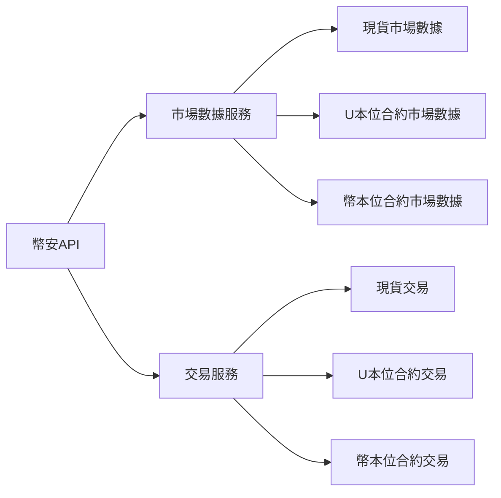

# 幣安API需求清單 - DES-V2交易系統

本文檔按**服務類型**分類列出所需的幣安API端點，分為**市場數據服務**（公開API）和**交易服務**（需認證）。

---

## 📊 一、市場數據服務 (Market Data Service)

> [!NOTE]
> 市場數據API為公開端點，大部分不需要API Key即可訪問。用於獲取行情、深度、成交等數據。

### 1.1 現貨市場數據 (Spot Market Data)

**Base URL**: `https://api.binance.com`  
**Testnet**: `https://testnet.binance.vision`

#### REST API

| 端點 | 方法 | 用途 | 權重 | 需認證 |
|------|------|------|------|--------|
| `/api/v3/ping` | GET | 測試連接 | 1 | ❌ |
| `/api/v3/time` | GET | 獲取服務器時間 | 1 | ❌ |
| `/api/v3/exchangeInfo` | GET | 交易規則和交易對信息 | 10 | ❌ |
| `/api/v3/depth` | GET | 訂單簿深度 | 1-50 | ❌ |
| `/api/v3/trades` | GET | 最近成交 | 1 | ❌ |
| `/api/v3/historicalTrades` | GET | 歷史成交 | 5 | ⚠️ API Key |
| `/api/v3/aggTrades` | GET | 歸集成交 | 1 | ❌ |
| `/api/v3/klines` | GET | K線數據 | 1 | ❌ |
| `/api/v3/avgPrice` | GET | 平均價格 | 1 | ❌ |
| `/api/v3/ticker/24hr` | GET | 24小時價格變動 | 1-40 | ❌ |
| `/api/v3/ticker/price` | GET | 最新價格 | 1-2 | ❌ |
| `/api/v3/ticker/bookTicker` | GET | 最優掛單 | 1-2 | ❌ |

#### WebSocket Streams

**Base URL**: `wss://stream.binance.com:9443/ws`

| 流名稱 | 示例 | 用途 |
|--------|------|------|
| Trade Streams | `btcusdt@trade` | 實時成交 |
| Kline/Candlestick Streams | `btcusdt@kline_1m` | 實時K線 |
| Individual Symbol Ticker | `btcusdt@ticker` | 單一交易對24h行情 |
| All Market Tickers | `!ticker@arr` | 所有交易對行情 |
| Individual Symbol Book Ticker | `btcusdt@bookTicker` | 最優買賣價 |
| Partial Book Depth | `btcusdt@depth5` | 有限檔深度 (5/10/20檔) |
| Diff. Depth Stream | `btcusdt@depth` | 深度增量推送 |

---

### 1.2 U本位合約市場數據 (USDT-M Futures Market Data)

**Base URL**: `https://fapi.binance.com`  
**Testnet**: `https://testnet.binancefuture.com`

#### REST API

| 端點 | 方法 | 用途 | 權重 | 需認證 |
|------|------|------|------|--------|
| `/fapi/v1/ping` | GET | 測試連接 | 1 | ❌ |
| `/fapi/v1/time` | GET | 服務器時間 | 1 | ❌ |
| `/fapi/v1/exchangeInfo` | GET | 交易規則 | 1 | ❌ |
| `/fapi/v1/depth` | GET | 訂單簿 | 調整 | ❌ |
| `/fapi/v1/trades` | GET | 最近成交 | 1 | ❌ |
| `/fapi/v1/historicalTrades` | GET | 歷史成交 | 5 | ⚠️ API Key |
| `/fapi/v1/aggTrades` | GET | 歸集成交 | 20 | ❌ |
| `/fapi/v1/klines` | GET | K線數據 | 1 | ❌ |
| `/fapi/v1/premiumIndex` | GET | 標記價格和資金費率 | 1 | ❌ |
| `/fapi/v1/fundingRate` | GET | 資金費率歷史 | 1 | ❌ |
| `/fapi/v1/ticker/24hr` | GET | 24小時價格變動 | 1-40 | ❌ |
| `/fapi/v1/ticker/price` | GET | 最新價格 | 1 | ❌ |
| `/fapi/v1/ticker/bookTicker` | GET | 最優掛單 | 1 | ❌ |
| `/fapi/v1/openInterest` | GET | 持倉量 | 1 | ❌ |

#### WebSocket Streams

**Base URL**: `wss://fstream.binance.com/stream`

| 流名稱 | 示例 | 用途 |
|--------|------|------|
| Aggregate Trade | `btcusdt@aggTrade` | 歸集成交流 |
| Mark Price | `btcusdt@markPrice` | 標記價格流 (1s更新) |
| Mark Price | `btcusdt@markPrice@1s` | 標記價格流 (每秒) |
| Kline/Candlestick | `btcusdt@kline_1m` | K線流 |
| Individual Symbol Ticker | `btcusdt@ticker` | 24小時滾動窗口行情 |
| All Market Tickers | `!ticker@arr` | 所有合約行情 |
| Individual Symbol Book Ticker | `btcusdt@bookTicker` | 最優掛單流 |
| Liquidation Order | `btcusdt@forceOrder` | 強平訂單流 |
| All Market Liquidation Orders | `!forceOrder@arr` | 所有強平訂單 |
| Partial Book Depth | `btcusdt@depth10@100ms` | 有限檔深度流 |
| Diff. Depth Stream | `btcusdt@depth` | 增量深度流 |

---

### 1.3 幣本位合約市場數據 (COIN-M Futures Market Data)

**Base URL**: `https://dapi.binance.com`  
**Testnet**: `https://testnet.binancefuture.com`

#### REST API

| 端點 | 方法 | 用途 | 權重 | 需認證 |
|------|------|------|------|--------|
| `/dapi/v1/ping` | GET | 測試連接 | 1 | ❌ |
| `/dapi/v1/time` | GET | 服務器時間 | 1 | ❌ |
| `/dapi/v1/exchangeInfo` | GET | 交易規則 | 1 | ❌ |
| `/dapi/v1/depth` | GET | 訂單簿 | 調整 | ❌ |
| `/dapi/v1/trades` | GET | 最近成交 | 1 | ❌ |
| `/dapi/v1/historicalTrades` | GET | 歷史成交 | 10 | ⚠️ API Key |
| `/dapi/v1/aggTrades` | GET | 歸集成交 | 20 | ❌ |
| `/dapi/v1/klines` | GET | K線數據 | 1 | ❌ |
| `/dapi/v1/premiumIndex` | GET | 標記價格和資金費率 | 1 | ❌ |
| `/dapi/v1/fundingRate` | GET | 資金費率歷史 | 1 | ❌ |
| `/dapi/v1/ticker/24hr` | GET | 24小時價格變動 | 1-40 | ❌ |
| `/dapi/v1/ticker/price` | GET | 最新價格 | 1 | ❌ |
| `/dapi/v1/ticker/bookTicker` | GET | 最優掛單 | 1 | ❌ |
| `/dapi/v1/openInterest` | GET | 持倉量 | 1 | ❌ |

#### WebSocket Streams

**Base URL**: `wss://dstream.binance.com/stream`

| 流名稱 | 示例 | 用途 |
|--------|------|------|
| Aggregate Trade | `btcusd_perp@aggTrade` | 歸集成交流 |
| Index Price | `btcusd@indexPrice` | 指數價格流 |
| Index Price | `btcusd@indexPrice@1s` | 指數價格流 (每秒) |
| Mark Price | `btcusd_perp@markPrice` | 標記價格流 |
| Kline/Candlestick | `btcusd_perp@kline_1m` | K線流 |
| Individual Symbol Ticker | `btcusd_perp@ticker` | 24小時行情 |
| All Market Tickers | `!ticker@arr` | 所有合約行情 |
| Individual Symbol Book Ticker | `btcusd_perp@bookTicker` | 最優掛單流 |
| Liquidation Order | `btcusd_perp@forceOrder` | 強平訂單流 |
| All Market Liquidation Orders | `!forceOrder@arr` | 所有強平訂單 |
| Partial Book Depth | `btcusd_perp@depth10@100ms` | 有限檔深度流 |
| Diff. Depth Stream | `btcusd_perp@depth` | 增量深度流 |

---

## 💼 二、交易服務 (Trading Service)

> [!IMPORTANT]
> 交易API需要API Key和簽名認證，用於下單、撤單、查詢賬戶等敏感操作。

### 2.1 現貨交易 (Spot Trading)

**Base URL**: `https://api.binance.com`

#### REST API - 需簽名 (SIGNED)

| 端點 | 方法 | 用途 | 權重 |
|------|------|------|------|
| `/api/v3/order` | POST | 下單 (限價/市價/止損等) | 1 |
| `/api/v3/order` | DELETE | 撤單 | 1 |
| `/api/v3/order` | GET | 查詢訂單狀態 | 2 |
| `/api/v3/openOrders` | GET | 查詢當前掛單 | 3 (單交易對) / 40 (全部) |
| `/api/v3/openOrders` | DELETE | 撤銷所有掛單 | 1 |
| `/api/v3/allOrders` | GET | 查詢所有訂單 | 10 |
| `/api/v3/orderList` | POST | OCO 訂單 | 1 |
| `/api/v3/account` | GET | 賬戶信息 (餘額、權限) | 10 |
| `/api/v3/myTrades` | GET | 賬戶成交歷史 | 10 |

#### User Data Stream

| 端點 | 方法 | 用途 | 權重 |
|------|------|------|------|
| `/api/v3/userDataStream` | POST | 創建Listen Key | 1 |
| `/api/v3/userDataStream` | PUT | 延長Listen Key有效期 | 1 |
| `/api/v3/userDataStream` | DELETE | 關閉Listen Key | 1 |

**User Data Stream WebSocket**: `wss://stream.binance.com:9443/ws/<listenKey>`

**推送事件**:
- `executionReport` - 訂單更新
- `outboundAccountPosition` - 賬戶餘額更新
- `balanceUpdate` - 餘額變動
- `listStatus` - OCO訂單狀態

---

### 2.2 U本位合約交易 (USDT-M Futures Trading)

**Base URL**: `https://fapi.binance.com`

#### REST API - 需簽名 (SIGNED)

| 端點 | 方法 | 用途 | 權重 |
|------|------|------|------|
| `/fapi/v1/order` | POST | 下單 | 1 |
| `/fapi/v1/order` | DELETE | 撤單 | 1 |
| `/fapi/v1/order` | GET | 查詢訂單 | 1 |
| `/fapi/v1/openOrders` | GET | 當前掛單 | 1 (單) / 40 (全部) |
| `/fapi/v1/openOrders` | DELETE | 撤銷所有掛單 | 1 |
| `/fapi/v1/allOrders` | GET | 查詢所有訂單 | 5 |
| `/fapi/v1/batchOrders` | POST | 批量下單 | 5 |
| `/fapi/v1/batchOrders` | DELETE | 批量撤單 | 1 |
| `/fapi/v2/account` | GET | 賬戶信息 | 5 |
| `/fapi/v2/balance` | GET | 賬戶餘額 | 5 |
| `/fapi/v2/positionRisk` | GET | 持倉信息 | 5 |
| `/fapi/v1/userTrades` | GET | 成交歷史 | 5 |
| `/fapi/v1/income` | GET | 收益歷史 | 30 |
| `/fapi/v1/leverage` | POST | 調整槓桿倍數 | 1 |
| `/fapi/v1/marginType` | POST | 變更保證金模式 (逐倉/全倉) | 1 |
| `/fapi/v1/positionSide/dual` | POST | 設置持倉模式 (單向/雙向) | 1 |
| `/fapi/v1/positionMargin` | POST | 調整逐倉保證金 | 1 |

#### User Data Stream

| 端點 | 方法 | 用途 |
|------|------|------|
| `/fapi/v1/listenKey` | POST | 創建Listen Key |
| `/fapi/v1/listenKey` | PUT | 延長Listen Key |
| `/fapi/v1/listenKey` | DELETE | 關閉Listen Key |

**User Data Stream WebSocket**: `wss://fstream.binance.com/ws/<listenKey>`

**推送事件**:
- `ORDER_TRADE_UPDATE` - 訂單/成交更新
- `ACCOUNT_UPDATE` - 賬戶更新 (餘額、持倉)
- `ACCOUNT_CONFIG_UPDATE` - 賬戶配置更新 (槓桿變更等)
- `MARGIN_CALL` - 追加保證金通知

---

### 2.3 幣本位合約交易 (COIN-M Futures Trading)

**Base URL**: `https://dapi.binance.com`

#### REST API - 需簽名 (SIGNED)

| 端點 | 方法 | 用途 | 權重 |
|------|------|------|------|
| `/dapi/v1/order` | POST | 下單 | 1 |
| `/dapi/v1/order` | DELETE | 撤單 | 1 |
| `/dapi/v1/order` | GET | 查詢訂單 | 1 |
| `/dapi/v1/openOrders` | GET | 當前掛單 | 1 (單) / 40 (全部) |
| `/dapi/v1/openOrders` | DELETE | 撤銷所有掛單 | 1 |
| `/dapi/v1/allOrders` | GET | 查詢所有訂單 | 20 |
| `/dapi/v1/batchOrders` | POST | 批量下單 | 5 |
| `/dapi/v1/batchOrders` | DELETE | 批量撤單 | 1 |
| `/dapi/v1/account` | GET | 賬戶信息 | 5 |
| `/dapi/v1/balance` | GET | 賬戶餘額 | 1 |
| `/dapi/v1/positionRisk` | GET | 持倉信息 | 1 |
| `/dapi/v1/userTrades` | GET | 成交歷史 | 20 |
| `/dapi/v1/income` | GET | 收益歷史 | 20 |
| `/dapi/v1/leverage` | POST | 調整槓桿倍數 | 1 |
| `/dapi/v1/marginType` | POST | 變更保證金模式 | 1 |
| `/dapi/v1/positionSide/dual` | POST | 設置持倉模式 | 1 |
| `/dapi/v1/positionMargin` | POST | 調整逐倉保證金 | 1 |

#### User Data Stream

| 端點 | 方法 | 用途 |
|------|------|------|
| `/dapi/v1/listenKey` | POST | 創建Listen Key |
| `/dapi/v1/listenKey` | PUT | 延長Listen Key |
| `/dapi/v1/listenKey` | DELETE | 關閉Listen Key |

**User Data Stream WebSocket**: `wss://dstream.binance.com/ws/<listenKey>`

**推送事件**: 同U本位合約

---

## 🔑 三、快速對照表

### 3.1 服務分類總覽



### 3.2 Base URL 對照

| 市場類型 | REST API | WebSocket |
|---------|----------|-----------|
| **現貨** | `https://api.binance.com` | `wss://stream.binance.com:9443` |
| **U本位合約** | `https://fapi.binance.com` | `wss://fstream.binance.com` |
| **幣本位合約** | `https://dapi.binance.com` | `wss://dstream.binance.com` |
| **現貨 (Testnet)** | `https://testnet.binance.vision` | - |
| **合約 (Testnet)** | `https://testnet.binancefuture.com` | - |

### 3.3 認證需求對比

| API類型 | API Key | 簽名 | 用途 |
|---------|---------|------|------|
| 市場數據 (大部分) | ❌ | ❌ | 獲取公開行情數據 |
| 歷史成交 | ✅ | ❌ | 獲取完整歷史成交記錄 |
| 交易API | ✅ | ✅ | 下單、撤單、查詢賬戶 |
| User Data Stream | ✅ | ❌ | 獲取私有數據推送 |

---

## 📋 四、DES-V2 系統當前使用情況

### 已實現 ✅

**市場數據服務**:
- ✅ 現貨 K線數據 (`/api/v3/klines`)
- ✅ 現貨 K線流 (`<symbol>@kline_<interval>`)
- ✅ 服務器時間 (`/api/v3/time`)

### 待實現 🔜

#### 優先級 1 (關鍵路徑)

**交易服務**:
1. 現貨下單/撤單 (`/api/v3/order`)
2. 賬戶查詢 (`/api/v3/account`)
3. 訂單查詢 (`/api/v3/openOrders`, `/api/v3/allOrders`)
4. User Data Stream (訂單更新推送)

#### 優先級 2 (功能擴展)

**市場數據服務**:
1. 實時成交流 (`<symbol>@trade`)
2. 最優掛單 (`<symbol>@bookTicker`)
3. 深度數據 (`/api/v3/depth`, `<symbol>@depth`)

**U本位合約交易**:
1. 合約下單 (`/fapi/v1/order`)
2. 持倉查詢 (`/fapi/v2/positionRisk`)
3. 槓桿調整 (`/fapi/v1/leverage`)
4. User Data Stream

#### 優先級 3 (可選)

**幣本位合約交易**: 全套API
**高級數據**: 資金費率、持倉量、強平數據

---

## 🚀 五、實施建議

### 階段1: 完善市場數據服務

```go
// pkg/binance/market_data.go
type MarketDataClient struct {
    BaseURL string
}

// 新增方法
func (c *MarketDataClient) GetTrades(symbol string, limit int) ([]Trade, error)
func (c *MarketDataClient) GetDepth(symbol string, limit int) (*OrderBook, error)
func (c *MarketDataClient) GetBookTicker(symbol string) (*BookTicker, error)
func (c *MarketDataClient) SubscribeTradeStream(symbol string) (<-chan Trade, error)
func (c *MarketDataClient) SubscribeBookTicker(symbol string) (<-chan BookTicker, error)
```

### 階段2: 實現現貨交易服務

```go
// pkg/binance/spot_trading.go
type SpotTradingClient struct {
    APIKey    string
    APISecret string
    BaseURL   string
}

// 交易方法
func (c *SpotTradingClient) PlaceOrder(order *Order) (*OrderResult, error)
func (c *SpotTradingClient) CancelOrder(symbol, orderId string) error
func (c *SpotTradingClient) GetAccount() (*Account, error)
func (c *SpotTradingClient) GetOpenOrders(symbol string) ([]Order, error)
func (c *SpotTradingClient) SubscribeUserData() (<-chan UserDataEvent, error)
```

### 階段3: 添加U本位合約支持

```go
// pkg/binance/futures_trading.go
type FuturesTradingClient struct {
    APIKey    string
    APISecret string
    BaseURL   string // fapi.binance.com
}

// 合約特有方法
func (c *FuturesTradingClient) SetLeverage(symbol string, leverage int) error
func (c *FuturesTradingClient) GetPosition(symbol string) (*Position, error)
func (c *FuturesTradingClient) ChangeMarginType(symbol, marginType string) error
```

---

## 📚 六、參考資料

- [Binance Spot API 文檔](https://binance-docs.github.io/apidocs/spot/en/)
- [Binance USDT-M Futures API](https://binance-docs.github.io/apidocs/futures/en/)
- [Binance COIN-M Futures API](https://binance-docs.github.io/apidocs/delivery/en/)
- [API 認證與簽名](https://binance-docs.github.io/apidocs/spot/en/#signed-trade-and-user_data-endpoint-security)
