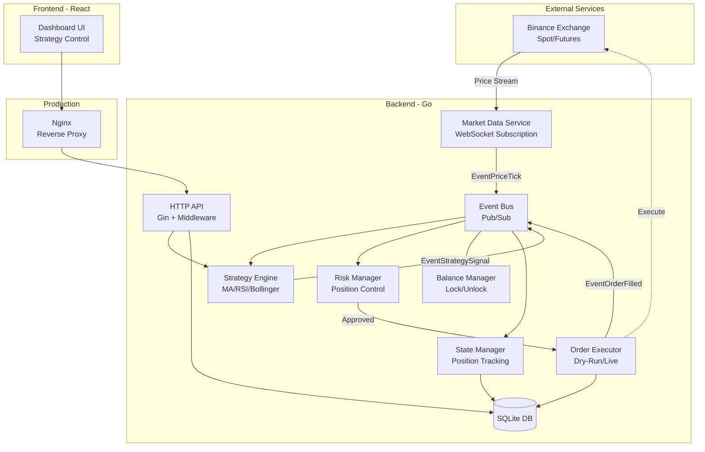
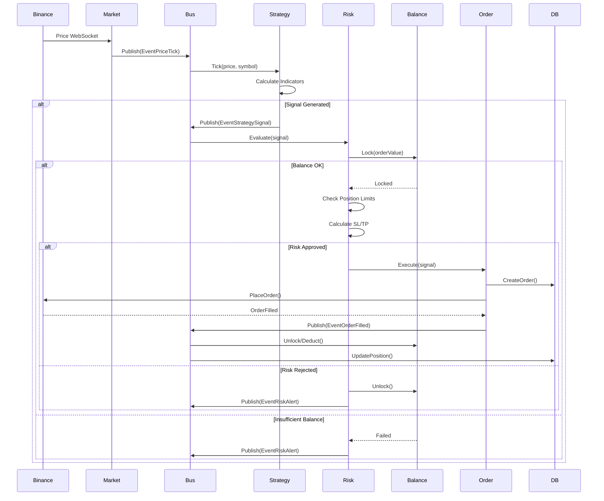
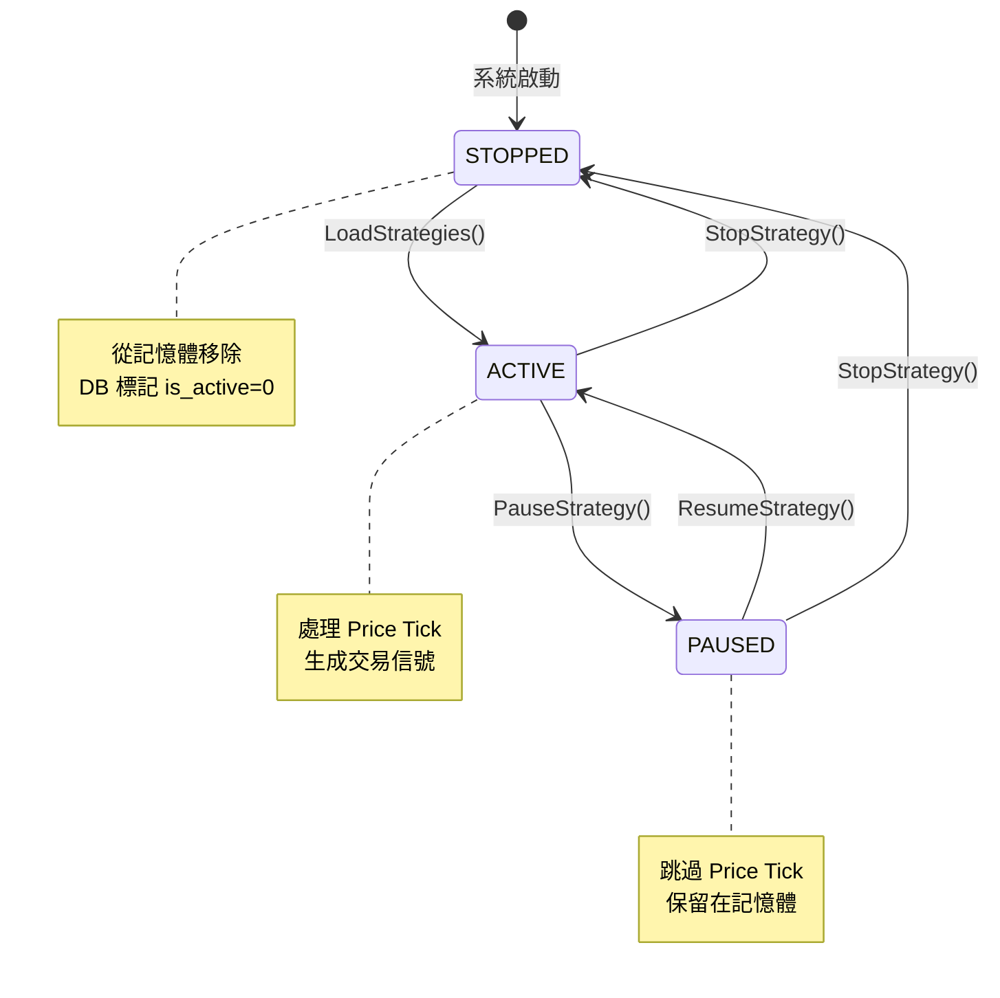
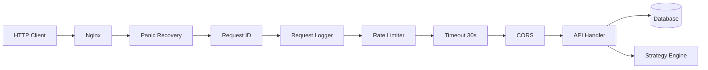

# DES Trading System v2.0 - 系統架構與功能文檔

> **技術文檔：核心功能、架構設計、數據流程**

---

## 📋 系統功能清單

### 核心交易功能
- ✅ **多市場支援**: Binance Spot / USDT Futures / COIN Futures
- ✅ **實時市場數據**: WebSocket 訂閱價格流
- ✅ **訂單執行**: 市價單自動執行與狀態追蹤
- ✅ **Dry Run 模式**: 模擬交易環境，不下真實訂單

### 策略引擎
- ✅ **內建策略**:
  - MA Cross (雙均線交叉)
  - RSI (相對強弱指標)
  - Bollinger Bands (布林通道)
- ✅ **策略配置**: YAML 文件定義策略參數
- ✅ **狀態持久化**: 策略狀態存儲於 SQLite，重啟後自動恢復
- ✅ **熱更新**: 無需重啟即可修改策略參數
- ✅ **生命週期管理**: Start / Pause / Stop / Panic Sell

### 風險管理
- ✅ **倉位控制**: 最大單一倉位限制 (% of capital)
- ✅ **每日虧損限制**: 觸發閾值後自動停止所有策略
- ✅ **止損/止盈**: 依據入場價自動計算 SL/TP
- ✅ **追蹤止損**: 盈利時動態調整止損價
- ✅ **餘額鎖定**: 下單前鎖定資金，防止超額下單

### 虛擬倉位追蹤
- ✅ **per-Strategy 持倉**: 獨立追蹤每個策略的倉位與 PnL
- ✅ **已實現 PnL**: 平倉時計算並記錄損益

### Web Dashboard
- ✅ **實時監控**: 策略列表、訂單狀態、持倉、餘額
- ✅ **策略控制**: 透過 UI 啟動/暫停/停止策略
- ✅ **參數編輯**: 在線修改策略參數
- ✅ **恐慌平倉**: 一鍵平掉策略所有倉位

### API & Middleware
- ✅ **RESTful API**: 策略、訂單、持倉、餘額查詢
- ✅ **Request ID 追蹤**: 每個請求分配唯一 UUID
- ✅ **Rate Limiting**: Per-IP 限流 (20 req/s)
- ✅ **Request Timeout**: 30秒超時保護
- ✅ **CORS**: 支援跨域請求

---

## 🏗️ 系統架構

### 整體架構圖



### 事件驅動架構

系統核心：**Event Bus** (發布-訂閱模式)

```go
// 核心事件類型
const (
    EventPriceTick      = "price.tick"       // 價格更新
    EventStrategySignal = "strategy.signal"  // 策略信號
    EventOrderFilled    = "order.filled"     // 訂單成交
    EventRiskAlert      = "risk.alert"       // 風險告警
)
```

**優點**：模塊解耦，易於擴展

---

## 🔄 核心數據流程

### 1️⃣ 交易執行流程



### 2️⃣ 策略生命週期



### 3️⃣ 虛擬倉位更新流程

```go
// UpdateStrategyPosition 邏輯
func UpdateStrategyPosition(strategyID, symbol, side string, qty, price float64) {
    // 1. 查詢當前倉位
    position := DB.GetStrategyPosition(strategyID)
    
    // 2. 根據交易方向更新
    switch side {
    case "BUY":
        newQty = position.Qty + qty
        avgPrice = (position.AvgPrice * position.Qty + price * qty) / newQty
        
    case "SELL":
        closeQty = min(position.Qty, qty)
        realizedPnL += (price - position.AvgPrice) * closeQty
        newQty = position.Qty - qty
    }
    
    // 3. 寫回數據庫
    DB.UpsertStrategyPosition(strategyID, symbol, newQty, avgPrice, realizedPnL)
}
```

### 4️⃣ API 請求流程 (含中間件)



**中間件順序很重要**：
1. Recovery (第一層：防止 panic 導致服務崩潰)
2. Request ID (生成追蹤 ID)
3. Logger (記錄請求，依賴 Request ID)
4. Rate Limiter (限流，防止濫用)
5. Timeout (超時保護)
6. CORS (跨域，最後處理)

---

## 📂 關鍵模組說明

### `internal/strategy/`
**職責**: 策略邏輯與引擎管理

```
strategy/
├── engine.go          → 策略引擎（加載、啟動、熱更新）
├── types.go           → Strategy 介面定義
├── ma_cross.go        → MA Cross 策略實作
├── rsi.go             → RSI 策略實作
├── bollinger.go       → Bollinger Bands 策略實作
└── config_loader.go   → 從 strategies.yaml 加載配置
```

**核心介面**:
```go
type Strategy interface {
    ID() string
    OnPrice(tick PriceTick, ctx Context) *Signal
    SaveState() ([]byte, error)
    LoadState(data []byte) error
}
```

### `internal/risk/`
**職責**: 風險控制與倉位管理

```go
type Manager struct {
    config    Config
    db        *sql.DB
    positions map[string]Position  // 當前倉位
}

// 核心方法
func (m *Manager) EvaluateSignal(signal SignalInput, position Position, account Account) Decision {
    // 1. 檢查倉位大小
    // 2. 檢查每日虧損
    // 3. 計算 SL/TP
    // 4. 返回 Decision (Allowed, AdjustedSize, StopLoss, TakeProfit)
}
```

### `internal/events/`
**職責**: 事件總線，解耦模組

```go
type Bus struct {
    mu          sync.RWMutex
    subscribers map[string][]chan interface{}
}

// 發布與訂閱
bus.Publish(events.EventPriceTick, tick)
stream := bus.Subscribe(events.EventStrategySignal, 100)
```

### `internal/order/`
**職責**: 訂單生命週期管理

```
order/
├── executor.go        → 訂單執行器（Dry-Run/Live）
├── queue.go           → 訂單隊列
├── types.go           → Order 結構定義
└── spot_stream.go     → Binance User Data Stream
```

### `pkg/db/`
**職責**: 數據庫 Schema 與操作

**核心資料表**:
```sql
-- 策略實例
CREATE TABLE strategy_instances (
    id TEXT PRIMARY KEY,
    name TEXT,
    strategy_type TEXT,
    symbol TEXT,
    parameters TEXT,  -- JSON
    status TEXT DEFAULT 'ACTIVE',
    is_active BOOLEAN
);

-- 策略虛擬倉位
CREATE TABLE strategy_positions (
    strategy_instance_id TEXT PRIMARY KEY,
    symbol TEXT,
    qty REAL,
    avg_price REAL,
    realized_pnl REAL
);

-- 訂單
CREATE TABLE orders (
    id TEXT PRIMARY KEY,
    strategy_instance_id TEXT,
    symbol TEXT,
    side TEXT,
    qty REAL,
    status TEXT
);
```

---

## 🎯 關鍵設計決策

### 1. 為何使用事件總線？
- **解耦**: 各模組不直接依賴，易於測試
- **擴展性**: 新增訂閱者無需修改發布者
- **靈活性**: 同一事件可被多個模組處理

### 2. 為何需要虛擬倉位（strategy_positions）？
- **獨立追蹤**: 每個策略的盈虧獨立計算
- **多策略並行**: 同一 symbol 可由多個策略交易
- **績效分析**: 清楚知道哪個策略表現最好

### 3. 狀態持久化的意義？
- **容錯**: 系統崩潰後，策略狀態不丟失
- **無縫重啟**: 策略從上次的指標狀態繼續運行
- **審計**: 可回溯任意時間點的策略狀態

### 4. Dry Run 模式的必要性？
- **安全測試**: 避免真金白銀的損失
- **策略驗證**: 確認邏輯正確再上線
- **參數調優**: 無風險測試不同參數組合

---

## 🔍 故障排查指引

### 策略未執行
**可能原因**:
1. WebSocket 連接斷開 → 查看日誌 `[WS]` 關鍵字
2. 策略狀態非 ACTIVE → 檢查 `strategy_instances.status`
3. 無價格 Tick → 確認 Market Data Service 正常

### 訂單未下單
**可能原因**:
1. `DRY_RUN=true` → 模擬模式不會真實下單
2. 風險管理拒絕 → 查看 `EventRiskAlert` 日誌
3. 餘額不足 → 確認 Balance Manager 狀態

### PnL 計算不準
**可能原因**:
1. Fee 未計入 → 檢查 `trades.fee` 欄位
2. 倉位未更新 → 確認 `UpdateStrategyPosition` 被調用
3. 平倉邏輯錯誤 → 檢查 SELL 時的 `closeQty` 計算

---

## 📚 延伸閱讀

- **詳細操作**: `docs/setup/QUICK_REFERENCE.md`
- **架構設計**: `docs/design/ADVANCED_FEATURES_DESIGN.md`
- **功能提案**: `docs/design/STRATEGY_FEATURES_PROPOSAL.md`
