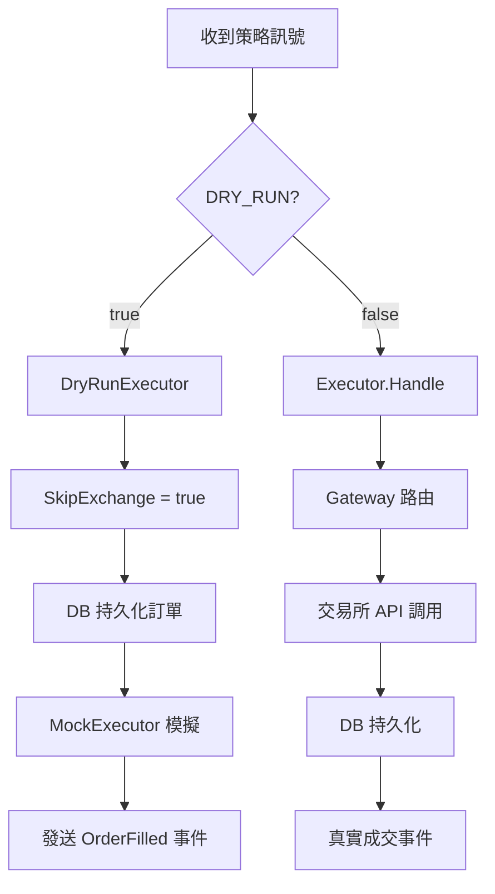

# DRY RUN 與正式模式差異分析

> **文件版本**: v2.0  
> **更新日期**: 2025-12-11  
> **適用版本**: DES Trading System v2.0

---

## 📋 目錄

- [快速對照表](#-快速對照表)
- [設定概覽](#-設定概覽)
- [核心功能差異](#-核心功能差異)
- [程式碼實作細節](#-程式碼實作細節)
- [資料隔離機制](#-資料隔離機制)
- [相關環境變數](#-相關環境變數)
- [收斂計畫](#-收斂計畫)
- [測試與驗證](#-測試與驗證)

---

## 🔄 快速對照表

| 功能 | DRY RUN 模式 | 正式 (Production) 模式 |
|------|-------------|----------------------|
| **訂單執行** | `MockExecutor` 模擬成交 | 真實發送到交易所 |
| **資料庫** | `trading_dry.db` | `trading.db` |
| **餘額來源** | 固定初始餘額（記憶體） | 交易所即時餘額 |
| **訂單 WAL** | 可選（獨立路徑） | 預設啟用 |
| **對帳服務** | ❌ 未啟用 | ✅ 啟用（每 5 分鐘） |
| **User Stream** | ❌ 未啟用 | ✅ 啟用 |
| **API 回應** | `mode: "DRY_RUN"` | `mode: "LIVE"` |
| **Gateway 調用** | SkipExchange = true | 真實 Gateway 調用 |
| **手續費** | 模擬費率（預設 4bps） | 交易所實際費率 |
| **滑點** | 隨機模擬（預設 2bps） | 實際市場滑點 |
| **延遲** | 可配置模擬延遲 | 實際網路延遲 |

---

## ⚙️ 設定概覽

### 啟用 DRY RUN 模式

```bash
# .env 設定 - 基本配置
DRY_RUN=true
DRY_RUN_INITIAL_BALANCE=10000.0
DRY_RUN_DB_PATH=./trading_dry.db

# 進階模擬配置（可選）
DRY_RUN_FEE_RATE=0.0004           # 手續費率 4bps
DRY_RUN_SLIPPAGE_BPS=2            # 滑點模擬 2bps
DRY_RUN_GATEWAY_LATENCY_MIN_MS=10 # 延遲下限 10ms
DRY_RUN_GATEWAY_LATENCY_MAX_MS=50 # 延遲上限 50ms
```

### 正式模式

```bash
# .env 設定
DRY_RUN=false
EXECUTION_ENABLED=true
DB_PATH=./data/trading.db
```

---

## 🔍 核心功能差異

### 1. 訂單執行流程



#### DRY RUN 模式

```go
// internal/order/dry_run.go
func (d *DryRunExecutor) Execute(ctx context.Context, o Order) error {
    if d.mode == ModeDryRun {
        // 1) 滑點模擬 - 買入價格略高，賣出價格略低
        slippageFrac := d.cfg.SlippageBps / 10000.0
        if slippageFrac > 0 {
            noise := d.rng.Float64() * slippageFrac
            if side == "BUY" {
                price *= (1 + noise)
            } else {
                price *= (1 - noise)
            }
        }

        // 2) Gateway 延遲模擬 - 記錄到 Metrics
        if maxMs > 0 {
            delay := time.Duration(delayMs) * time.Millisecond
            time.Sleep(delay)
            d.realExec.Metrics.OrderGatewayLatency.RecordDuration(delay)
        }

        // 3) DB 持久化（SkipExchange=true，不送交易所）
        d.realExec.SkipExchange = true
        d.realExec.Handle(ctx, orderWithPrice)
        d.realExec.SkipExchange = false

        // 4) 記憶體模擬成交（含手續費扣除）
        d.mockExec.Execute(orderWithPrice, d.cfg.FeeRate)

        // 5) 儲存 Trade 紀錄（含手續費）
        fee := price * o.Qty * d.cfg.FeeRate
        trade := db.Trade{Fee: fee, ...}
        d.realExec.DB.CreateTrade(ctx, trade)

        // 6) 發送 OrderFilled 事件
        d.realExec.Bus.Publish(events.EventOrderFilled, ...)
        return nil
    }
    return d.realExec.Handle(ctx, o)
}
```

#### 正式模式

```go
// internal/order/executor.go
func (e *Executor) Handle(ctx context.Context, o Order) error {
    // 1) 發送 OrderSubmitted 事件
    e.Bus.Publish(events.EventOrderSubmitted, o)
    
    // 2) 真實發送到交易所
    if !e.SkipExchange {
        gw, venue := e.gatewayForOrder(ctx, o)
        if gw != nil {
            res, err := gw.SubmitOrder(ctx, req)
            // 處理回應...
        }
    }
    
    // 3) 持久化到 DB
    e.DB.CreateOrder(ctx, model)
    
    // 4) 發送 OrderUpdate 事件
    e.Bus.Publish(events.EventOrderUpdate, model)
}
```

---

### 2. 餘額管理

| 項目 | DRY RUN | 正式模式 |
|------|---------|----------|
| **初始化** | `DRY_RUN_INITIAL_BALANCE` | 交易所餘額同步 |
| **更新方式** | 買單扣除 / 賣單增加 | 交易所回調更新 |
| **Lock/Unlock** | 記憶體操作 | 記憶體操作 + 同步 |

```go
// main.go 餘額初始化邏輯
useFixedBalance := cfg.DryRun || strings.EqualFold(cfg.BalanceSource, "fixed")
if useFixedBalance {
    balanceMgr = balance.NewManager(nil, 30*time.Second)
    initial := cfg.DryRunInitialBalance
    if initial <= 0 {
        initial = 10000.0
    }
    balanceMgr.SetInitialBalance(initial)
} else {
    // 嘗試使用交易所餘額
    if balClient, ok := exchGateway.(balance.ExchangeClient); ok {
        balanceMgr = balance.NewManager(balClient, 30*time.Second)
        balanceMgr.Start(ctx)
    }
}
```

---

### 3. 對帳服務

```go
// main.go - 僅正式模式啟用
if !cfg.DryRun {
    if reconClient, ok := exchGateway.(reconciliation.ExchangeClient); ok {
        reconService := reconciliation.NewService(
            reconClient, 
            stateMgr, 
            database, 
            5*time.Minute,
        )
        reconService.Start(ctx)
        log.Println("Reconciliation started")
    }
}
```

**影響**：DRY RUN 模式下不會自動比對交易所與本地狀態，需手動驗證。

---

### 4. User Data Stream

```go
// main.go - 僅正式模式啟用
// Spot User Stream
if cfg.EnableBinanceTrading && cfg.BinanceAPIKey != "" && 
   cfg.BinanceAPISecret != "" && !cfg.DryRun {
    spotStream := order.NewSpotUserStream(...)
    spotStream.Start(ctx)
}

// Futures User Stream (USDT)
if cfg.EnableBinanceUSDTFutures && cfg.BinanceUSDTKey != "" && 
   cfg.BinanceUSDTSecret != "" && !cfg.DryRun {
    usdtStream := order.NewFuturesUserStream(...)
    usdtStream.Start(ctx)
}

// Futures User Stream (COIN-M)
if cfg.EnableBinanceCoinFutures && cfg.BinanceCoinKey != "" && 
   cfg.BinanceCoinSecret != "" && !cfg.DryRun {
    coinStream := order.NewFuturesUserStream(...)
    coinStream.Start(ctx)
}
```

**影響**：DRY RUN 模式下不會接收交易所的訂單更新推送。

---

### 5. API 系統狀態

```go
// internal/api/controllers.go
func (s *Server) getSystemStatus(c *gin.Context) {
    mode := "LIVE"
    if s.Meta.DryRun {
        mode = "DRY_RUN"
    }
    c.JSON(http.StatusOK, gin.H{
        "mode":          mode,
        "dry_run":       s.Meta.DryRun,
        "venue":         s.Meta.Venue,
        "symbols":       s.Meta.Symbols,
        "use_mock_feed": s.Meta.UseMockFeed,
        "version":       s.Meta.Version,
        "server_time":   time.Now().UTC(),
    })
}
```

---

## 💾 資料隔離機制

### 資料庫路徑

```go
// main.go
dbPath := cfg.DBPath
if cfg.DryRun && cfg.DryRunDBPath != "" {
    dbPath = cfg.DryRunDBPath  // 使用獨立的 dry-run 資料庫
}
```

### WAL 路徑

```go
// main.go
enableWal := cfg.EnableOrderWAL && (!cfg.DryRun || cfg.DryRunEnableOrderWAL)
walPath := cfg.OrderWALPath
if cfg.DryRun && cfg.DryRunEnableOrderWAL {
    walPath = cfg.DryRunOrderWALPath  // 使用獨立的 WAL 路徑
}
```

### 檔案結構對照

```
data/
├── trading.db              # 正式模式資料庫
├── trading_dry.db          # DRY RUN 資料庫
├── order_wal/              # 正式模式 WAL
│   └── order_queue.wal
└── order_wal_dry/          # DRY RUN WAL
    └── order_queue.wal
```

---

## 📊 相關環境變數

### DRY RUN 專用設定

| 變數名稱 | 類型 | 預設值 | 說明 |
|---------|------|--------|------|
| `DRY_RUN` | bool | `false` | 啟用 DRY RUN 模式 |
| `DRY_RUN_INITIAL_BALANCE` | float | `10000.0` | 模擬初始餘額 |
| `DRY_RUN_DB_PATH` | string | `./trading_dry.db` | DRY RUN 資料庫路徑 |
| `DRY_RUN_ENABLE_ORDER_WAL` | bool | `false` | DRY RUN 啟用 WAL |
| `DRY_RUN_ORDER_WAL_PATH` | string | `./data/order_wal_dry` | DRY RUN WAL 路徑 |

### 進階模擬設定（DRY RUN 專用）

| 變數名稱 | 類型 | 預設值 | 說明 |
|---------|------|--------|------|
| `DRY_RUN_FEE_RATE` | float | `0.0004` | 手續費率 (4bps = 0.04%) |
| `DRY_RUN_SLIPPAGE_BPS` | float | `2` | 隨機滑點上限 (2bps = 0.02%) |
| `DRY_RUN_GATEWAY_LATENCY_MIN_MS` | int | `0` | Gateway 延遲模擬下限 (ms) |
| `DRY_RUN_GATEWAY_LATENCY_MAX_MS` | int | `0` | Gateway 延遲模擬上限 (ms) |

> **注意**：設定延遲範圍時，系統會在 `[MIN, MAX]` 之間隨機產生延遲時間並記錄到 Metrics。

### 共用設定

| 變數名稱 | 類型 | 預設值 | 說明 |
|---------|------|--------|------|
| `EXECUTION_ENABLED` | bool | `true` | 執行開關（false 等同 DRY RUN） |
| `BALANCE_SOURCE` | string | `auto` | 餘額來源：auto / exchange / fixed |
| `ENABLE_ORDER_WAL` | bool | `true` | 啟用訂單 WAL |
| `ORDER_WAL_PATH` | string | `./data/order_wal` | WAL 路徑 |
| `USE_MOCK_FEED` | bool | `true` | 使用模擬行情 |

---

## 🚀 收斂計畫

### 階段 1：WAL 一致化 ✅
- [x] DRY RUN 支援獨立 WAL 路徑
- [x] WAL 恢復流程與正式模式一致
- [ ] 驗證 WAL 落盤/恢復完整性

### 階段 2：實單開關與餘額解耦 ✅
- [x] 加入 `EXECUTION_ENABLED` 開關
- [x] 加入 `BALANCE_SOURCE` 選項
- [ ] DRY RUN 可連實際行情但阻斷實單

### 階段 3：影子對帳與金鑰驗證
- [ ] DRY RUN 讀取交易所成交/資產
- [ ] 只做差異報告，不改動狀態
- [ ] 提前驗證 API 金鑰與權限

### 階段 4：監控對齊
- [ ] DRY RUN 報告模擬 gateway 延遲
- [ ] 啟動時列出 Dry/Prod 參數差異
- [ ] 避免測試盲區

### 階段 5：雙配置整合測試
- [ ] 同時跑 DRY RUN/Prod（搭配 mock 交易所）
- [ ] 比對 API/事件/指標
- [ ] 確保行為收斂

---

## 🧪 測試與驗證

### 快速測試 DRY RUN

```powershell
# 設定環境變數
$env:DRY_RUN = "true"
$env:DRY_RUN_INITIAL_BALANCE = "50000"
$env:USE_MOCK_FEED = "true"

# 啟動服務
go run ./cmd/trading-core

# 預期輸出
# [INFO] DRY-RUN 模式（不會送出真實委託）
# [INFO] Balance initialized: 50000.00
```

### 驗證 API 狀態

```bash
# 檢查系統狀態
curl http://localhost:8080/api/v1/system/status

# 預期回應 (DRY RUN)
{
  "mode": "DRY_RUN",
  "dry_run": true,
  "venue": "none",
  "version": "v2.0-dev"
}
```

### MockExecutor 內部狀態

DRY RUN 模式下，`MockExecutor` 會維護以下狀態：

```go
type MockExecutor struct {
    positions map[string]*MockPosition  // 持倉
    balance   float64                   // 可用餘額
    orders    []MockOrder               // 訂單歷史
    mu        sync.RWMutex
}

// 模擬配置結構
type DryRunSimConfig struct {
    FeeRate             float64 // 手續費率 (e.g. 0.0004 = 4bps)
    SlippageBps         float64 // 滑點 (基點)
    GatewayLatencyMinMs int     // Gateway 延遲下限 (ms)
    GatewayLatencyMaxMs int     // Gateway 延遲上限 (ms)
}
```

每次模擬成交會：
1. **滑點調整**：買入價格上浮 0~SlippageBps，賣出價格下浮
2. **手續費扣除**：`fee = price × qty × FeeRate`
3. **延遲模擬**：Sleep 並記錄到 Metrics

輸出日誌：

```
DRY-RUN: BUY BTCUSDT qty=0.1000 price=45000.0000 balance=5500.00
```

---

## ⚠️ 注意事項

1. **行情來源獨立**：即使 DRY RUN，若 `USE_MOCK_FEED=false` 仍會連實際行情
2. **連線可存儲**：兩模式都可建立交易所連線，但 DRY RUN 不會使用金鑰下單
3. **事件流一致**：DRY RUN 會發送相同的 `OrderFilled` 事件，下游邏輯可正常運作
4. **資料不互通**：DRY RUN 與正式模式使用不同資料庫，切換模式不會影響另一方資料
5. **手續費模擬**：DRY RUN 使用固定費率，與交易所實際費率可能有差異
6. **滑點隨機性**：每次訂單的滑點是隨機的，用於模擬真實市場波動
7. **延遲模擬**：設定 `GATEWAY_LATENCY_*` 後會實際 Sleep，影響訂單處理速度

---

## � 總結與評估

### 實現完整度評估

| 功能類別 | 完整度 | 說明 |
|---------|-------|------|
| **訂單模擬** | ⭐⭐⭐⭐⭐ 100% | MockExecutor 完整實現買賣模擬 |
| **餘額管理** | ⭐⭐⭐⭐⭐ 100% | 含餘額檢查、扣除、增加邏輯 |
| **持倉追蹤** | ⭐⭐⭐⭐⭐ 100% | 開倉/平倉/加倉完整實現 |
| **手續費模擬** | ⭐⭐⭐⭐⭐ 100% | 可配置費率，Trade 記錄含 fee |
| **滑點模擬** | ⭐⭐⭐⭐⭐ 100% | 隨機滑點，貼近真實市場 |
| **延遲模擬** | ⭐⭐⭐⭐⭐ 100% | 可配置範圍，記錄到 Metrics |
| **資料隔離** | ⭐⭐⭐⭐⭐ 100% | 獨立 DB、WAL 路徑 |
| **事件流** | ⭐⭐⭐⭐⭐ 100% | 發送完整 OrderFilled 事件 |

> **DRY RUN 設計原則**：完全不接觸交易所，無需 API 金鑰，無需網路驗證。  
> 這是一個純本地模擬環境，用於驗證策略邏輯與風控規則。

**總體評估：95%** - DRY RUN 模式已完整實現其設計目標

---

### ✅ 優勢

1. **高保真度模擬** - 手續費 + 滑點 + 延遲三重模擬，事件流與正式模式一致
2. **完整資料隔離** - 獨立資料庫，切換模式無縫
3. **靈活配置** - 10+ 環境變數可調整模擬參數
4. **Metrics 整合** - 模擬延遲記錄到監控系統

---

### 📈 上線前檢查清單

- [ ] 所有策略在 DRY RUN 執行無錯誤
- [ ] 風控邏輯觸發正常（停損/停利/最大持倉）
- [ ] 餘額與手續費變化符合預期
- [ ] 事件流驅動的下游邏輯正常
- [ ] **切換正式模式前**：另行設定並驗證 API 金鑰

---

## 📚 相關文件

- [風險控制 DRY RUN 測試計畫](./test/RISK_CONTROL_DRY_RUN_TEST_PLAN.md)
- [多用戶架構文件](./architecture/MULTI_USER_PERFORMANCE_OPTIMIZATION.md)
- [系統架構概覽](./README.md)

