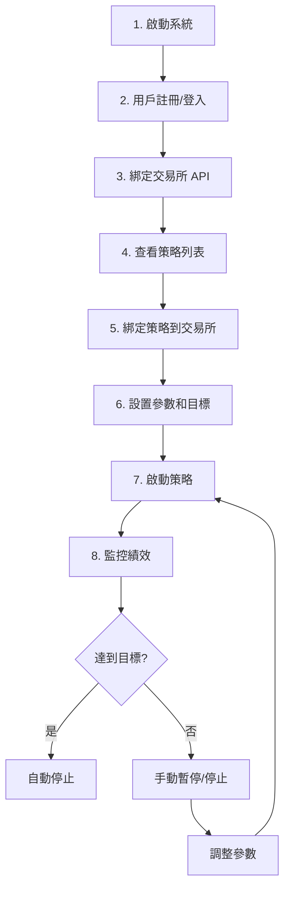

# DES Trading System - 使用指南

> 一個模擬用戶從註冊到實際交易的完整流程

---

## 📋 快速導覽

| 章節 | 說明 |
|------|------|
| [1. 系統啟動](#1-系統啟動) | 啟動後端和前端 |
| [2. 用戶註冊登入](#2-用戶註冊登入) | 創建帳號 |
| [3. 綁定交易所](#3-綁定交易所) | 連接 API Key |
| [4. 策略管理](#4-策略管理) | 配置和控制策略 |
| [5. 監控與報告](#5-監控與報告) | 查看績效 |

---

## 1. 系統啟動

### 啟動後端
```bash
cd backend/cmd/trading-core
go run main.go
# 輸出：Server running on :8080
```

### 啟動前端
```bash
cd frontend
npm run dev
# 輸出：http://localhost:5173
```

---

## 2. 用戶註冊登入

### 註冊新用戶
```bash
POST /api/auth/register
{
  "email": "user@example.com",
  "password": "SecurePass123"
}
# 返回: { "token": "jwt...", "user_id": "xxx" }
```

### 登入
```bash
POST /api/auth/login
{
  "email": "user@example.com",
  "password": "SecurePass123"
}
# 返回: { "token": "jwt..." }
```

### 前端操作
1. 訪問 http://localhost:5173
2. 點擊「註冊」→ 輸入 Email 和密碼
3. 登入後進入儀表板

---

## 3. 綁定交易所

### 創建 API 連線
```bash
POST /api/connections
Authorization: Bearer <token>
{
  "name": "我的幣安帳號",
  "exchange_type": "binance_futures_usdt",
  "api_key": "your_api_key",
  "api_secret": "your_api_secret"
}
```

### 支援的交易所類型
| 類型 | 說明 |
|------|------|
| `binance_spot` | 幣安現貨 |
| `binance_futures_usdt` | 幣安 USDT 永續合約 |
| `binance_futures_coin` | 幣安幣本位合約 |

### 查看我的連線
```bash
GET /api/connections
# 返回連線列表
```

---

## 4. 策略管理

### 4.1 查看策略列表
```bash
GET /api/strategies
# 返回所有策略及其狀態
```

### 4.2 策略操作

| 操作 | API | 說明 |
|------|-----|------|
| **啟動** | `POST /api/strategies/:id/start` | 開始交易 |
| **暫停** | `POST /api/strategies/:id/pause` | 暫停但保留倉位 |
| **停止** | `POST /api/strategies/:id/stop` | 完全停止 |
| **緊急平倉** | `POST /api/strategies/:id/panic` | 市價平倉並停止 |

### 4.3 修改參數
```bash
PUT /api/strategies/:id/params
{
  "fast_period": 10,
  "slow_period": 30,
  "size": 0.01
}
```

### 4.4 綁定交易所連線
```bash
PUT /api/strategies/:id/binding
{
  "connection_id": "conn_xxx"
}
```

### 4.5 設置利潤目標 (新功能)
```sql
-- 達 500 USDT 自動停止
UPDATE strategy_instances 
SET profit_target = 500, profit_target_type = 'USDT' 
WHERE id = 'xxx';
```

### 4.6 設置 Maker Only (新功能)
```sql
UPDATE strategy_instances 
SET time_in_force = 'GTX' 
WHERE id = 'xxx';
```

---

## 5. 監控與報告

### 5.1 系統狀態
```bash
GET /api/system/status
# 返回: { "mode": "LIVE", "venue": "binance_futures_usdt", ... }
```

### 5.2 餘額查詢
```bash
GET /api/balance
# 返回: { "total": 10000, "available": 9500, "locked": 500 }
```

### 5.3 持倉查詢
```bash
GET /api/positions
# 返回持倉列表
```

### 5.4 訂單查詢
```bash
GET /api/orders
# 返回訂單歷史
```

### 5.5 策略績效
```bash
GET /api/strategies/:id/performance
# 返回 PnL 曲線數據
```

### 5.6 風險指標
```bash
GET /api/risk
# 返回當日交易數、盈虧等
```

---

## 🔄 典型使用流程



---

## 📱 前端功能

| 頁面 | 功能 |
|------|------|
| **儀表板** | 總覽、餘額、持倉 |
| **策略管理** | 查看、控制策略 |
| **績效報告** | PnL 圖表 |
| **設置** | 連線管理、風控參數 |

---

## ⚠️ 注意事項

1. **Dry-Run 模式**: 首次使用建議開啟模擬模式
2. **API Key 權限**: 只需讀取 + 交易權限，無需提款
3. **風控設置**: 建議設置每日虧損限制
4. **利潤目標**: 設置後達標會自動停止策略

---

## 🆘 常見問題

### Q: 策略沒有交易？
- 檢查是否已綁定交易所連線
- 確認策略狀態為 ACTIVE
- 查看系統日誌

### Q: 如何查看日誌？
```bash
# 後端日誌直接在終端顯示
# 或查看 WebSocket 實時推送
```

### Q: 如何重置策略？
```bash
POST /api/strategies/:id/stop  # 先停止
# 然後清除 strategy_states 表
POST /api/strategies/:id/start # 重新啟動
```
