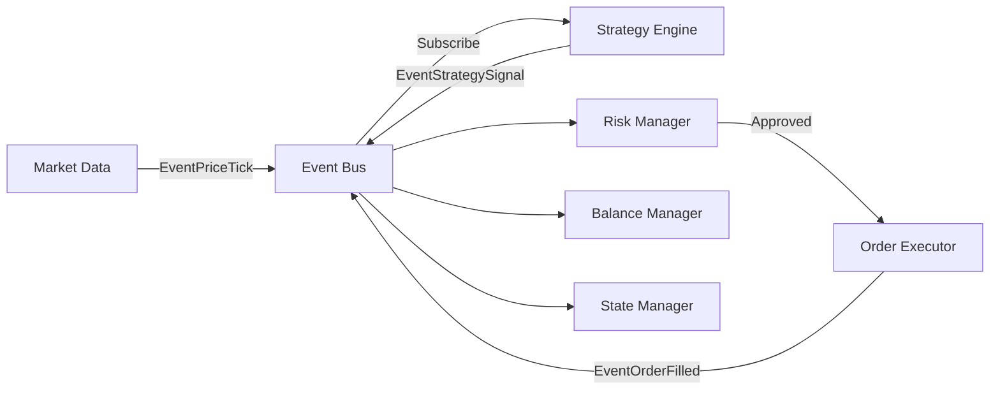

# DES Trading System v2.0 - 開發者上手指南

> **完整的交易系統 - 從零開始的開發者手冊**

本文檔旨在幫助新加入的開發者快速理解系統架構、部署環境，並開始貢獻代碼。

---

## 📋 目錄

1. [系統概述](#系統概述)
2. [技術棧](#技術棧)
3. [專案結構](#專案結構)
4. [環境設置](#環境設置)
5. [核心功能](#核心功能)
6. [架構設計](#架構設計)
7. [開發工作流](#開發工作流)
8. [測試指南](#測試指南)
9. [部署指南](#部署指南)
10. [常見問題](#常見問題)

---

## 系統概述

**DES Trading System v2.0** 是一個全功能的自動化交易系統，支援：
- 🤖 **策略自動化**：MA Cross、RSI、Bollinger Bands 等內建策略
- 📊 **實時市場數據**：WebSocket 連接 Binance 市場 (Spot / USDT Futures / COIN Futures)
- 🛡️ **風險管理**：動態止損/止盈、倉位控制、每日虧損限制
- 💰 **餘額管理**：實時追蹤可用/鎖定餘額
- 🌐 **Web Dashboard**：React 前端，實時監控策略、訂單、持倉
- 🔧 **策略熱更新**：無需重啟系統即可修改策略參數

---

## 技術棧

### 後端 (Go)
- **語言**: Go 1.21+
- **Web 框架**: Gin
- **數據庫**: SQLite (可擴展至 PostgreSQL)
- **WebSocket**: Gorilla WebSocket
- **API 客戶端**: 自研 Binance REST/WebSocket 封裝

### 前端 (React)
- **框架**: React 18 + Vite
- **UI 庫**: Tailwind CSS
- **HTTP 客戶端**: Axios
- **路由**: React Router DOM

### 生產環境
- **反向代理**: Nginx (HTTPS、Gzip、Rate Limiting)
- **部署**: Docker / 本地二進制
- **監控**: (待實作) Prometheus + Grafana

---

## 專案結構

```
DES-V2/
├── backend/cmd/trading-core/       # Go 後端主程式
│   ├── internal/                   # 內部模組
│   │   ├── api/                    # HTTP API 與 Middleware
│   │   ├── balance/                # 餘額管理
│   │   ├── events/                 # 事件總線
│   │   ├── indicators/             # 技術指標引擎
│   │   ├── market/                 # 市場數據訂閱
│   │   ├── order/                  # 訂單執行與狀態追蹤
│   │   ├── reconciliation/         # 對帳服務
│   │   ├── risk/                   # 風險管理
│   │   ├── state/                  # 持倉狀態管理
│   │   └── strategy/               # 策略引擎與實作
│   ├── pkg/                        # 可重用模組
│   │   ├── binance/                # Binance WebSocket
│   │   ├── config/                 # 配置加載
│   │   ├── db/                     # SQLite 操作與 Schema
│   │   └── exchanges/              # 交易所抽象層
│   ├── deployment/                 # Nginx 配置
│   ├── scripts/                    # 測試腳本
│   ├── main.go                     # 程式入口
│   ├── strategies.yaml             # 策略配置檔
│   └── .env                        # 環境變數 (請複製 .env.example)
│
├── frontend/                       # React 前端
│   ├── src/
│   │   ├── components/             # React 組件
│   │   ├── api.js                  # API 客戶端
│   │   └── App.jsx                 # 主應用
│   ├── public/
│   └── package.json
│
├── docs/                           # 技術文檔
│   ├── design/ADVANCED_FEATURES_DESIGN.md
│   ├── FEATURE_GAP_ANALYSIS.md
│   └── design/STRATEGY_FEATURES_PROPOSAL.md
│
└── python/                         # (可選) Python 策略工作器
    └── worker/
```

---

## 環境設置

### 1. 前置需求

#### 必要工具
- **Go**: 1.21 或更高版本
- **Node.js**: 18 或更高版本
- **Git**: 版本控制

#### 可選工具
- **Docker**: 用於容器化部署
- **Nginx**: 生產環境反向代理

### 2. Clone 專案

```bash
git clone <repository-url>
cd DES-V2
```

### 3. 後端設置

#### 安裝依賴
```bash
cd backend/cmd/trading-core
go mod download
```

#### 配置環境變數
```bash
cp .env.example .env
# 編輯 .env，填入您的 Binance API 金鑰
```

**重要環境變數**：
```env
# Binance API (現貨)
BINANCE_API_KEY=your_api_key
BINANCE_API_SECRET=your_api_secret
BINANCE_TESTNET=true

# 系統配置
DRY_RUN=true                    # 模擬模式，不會真正下單
PORT=8080
INITIAL_BALANCE=10000.0

# 風險參數
MAX_POSITION_SIZE=0.1
DAILY_LOSS_LIMIT=-500.0
USE_STOP_LOSS=true
```

#### 啟動後端
```bash
go run main.go
```

成功啟動會看到：
```
2025/12/01 16:00:00.123456 Starting DES Trading System...
2025/12/01 16:00:00.234567 Config loaded (Port: 8080)
2025/12/01 16:00:00.345678 ✓ Strategies synced to DB
```

### 4. 前端設置

```bash
cd ../../frontend
npm install
npm run dev
```

前端會在 `http://localhost:5173` 啟動。

---

## 核心功能

### 1. 策略管理

#### 支援的策略
| 策略名稱 | 描述 | 參數 |
|---------|------|------|
| **MA Cross** | 雙均線交叉 | `fast` (快線), `slow` (慢線), `size` (倉位) |
| **RSI** | 超買超賣指標 | `period`, `oversold`, `overbought`, `size` |
| **Bollinger** | 布林通道 | `period`, `stddev`, `size` |

#### 配置檔：`strategies.yaml`
```yaml
- id: ma_btc_1
  name: "MA Cross BTC"
  strategy_type: ma_cross
  symbol: BTCUSDT
  interval: 1m
  is_active: true
  parameters:
    fast: 5
    slow: 20
    size: 0.001
```

#### 動態管理
- **Web Dashboard**: 透過前端介面啟動/暫停/停止策略
- **熱更新**: 編輯參數無需重啟
- **Panic Sell**: 一鍵平倉功能

### 2. 訂單執行

- **自動掛單**: 策略信號 → 風險檢查 → 訂單創建 → 交易所執行
- **Dry Run 模式**: 測試環境，不會真正下單
- **訂單追蹤**: 數據庫記錄所有訂單狀態變化

### 3. 風險管理

#### 功能
- ✅ **倉位限制**: 單一倉位不超過總資金 10%
- ✅ **每日虧損限制**: 達到閾值自動停止所有策略
- ✅ **動態止損/止盈**: 依據入場價自動計算
- ✅ **追蹤止損**: 盈利時動態調整止損價

#### 配置 (.env)
```env
MAX_POSITION_SIZE=0.1           # 最大倉位 10%
DAILY_LOSS_LIMIT=-500.0         # 每日虧損限制
STOP_LOSS_PERCENT=0.02          # 止損 2%
TAKE_PROFIT_PERCENT=0.05        # 止盈 5%
```

### 4. Web Dashboard

#### 功能
- 📊 **實時監控**: 策略列表、訂單狀態、持倉、餘額
- 🎮 **策略控制**: Start / Pause / Stop / Panic / Edit
- 📈 **風險指標**: 每日 PnL、勝率、總交易數

#### 路由
- `/` - 主儀表板
- `/api/strategies` - 策略列表 API
- `/api/orders` - 訂單列表 API
- `/api/balance` - 餘額查詢 API

---

## 架構設計

### 事件驅動架構

系統採用 **Event Bus** 模式解耦各模組：



### 核心事件類型
```go
const (
    EventPriceTick      = "price.tick"
    EventStrategySignal = "strategy.signal"
    EventOrderFilled    = "order.filled"
    EventRiskAlert      = "risk.alert"
)
```

### 數據流

1. **市場數據** → `market/binance.go` 訂閱 WebSocket
2. **價格更新** → 發布 `EventPriceTick`
3. **策略引擎** → 接收價格，計算指標，生成信號
4. **風險管理** → 驗證信號，鎖定餘額
5. **訂單執行** → 向交易所下單
6. **成交回報** → 更新持倉、解鎖餘額、記錄 PnL

---

## 開發工作流

### 1. 新增策略

**範例：新增 MACD 策略**

#### 步驟 1: 創建策略檔
```go
// internal/strategy/macd.go
package strategy

type MACDStrategy struct {
    id       string
    symbol   string
    interval string
    params   MACDParams
    state    MACDState
}

type MACDParams struct {
    FastPeriod int     `json:"fast_period"`
    SlowPeriod int     `json:"slow_period"`
    SignalPeriod int   `json:"signal_period"`
    Size       float64 `json:"size"`
}

func (s *MACDStrategy) OnPrice(tick PriceTick, ctx Context) *Signal {
    // 實作 MACD 邏輯
    // ...
}
```

#### 步驟 2: 註冊到工廠
```go
// internal/strategy/engine.go
func instantiateStrategy(cfg StrategyConfig, ctx Context) (Strategy, error) {
    switch cfg.StrategyType {
    case "macd":
        return NewMACDStrategy(cfg), nil
    // ...
    }
}
```

#### 步驟 3: 更新配置檔
```yaml
# strategies.yaml
- id: macd_eth_1
  strategy_type: macd
  symbol: ETHUSDT
  interval: 5m
  parameters:
    fast_period: 12
    slow_period: 26
    signal_period: 9
    size: 0.01
```

### 2. 新增 API 端點

```go
// internal/api/controllers.go
func (s *Server) getCustomMetric(c *gin.Context) {
    // 實作邏輯
    c.JSON(http.StatusOK, gin.H{"metric": "value"})
}

// internal/api/handler.go
func (s *Server) routes() {
    api := s.Router.Group("/api")
    api.GET("/custom-metric", s.getCustomMetric)
}
```

### 3. 修改前端

```javascript
// frontend/src/api.js
export const getCustomMetric = () => api.get('/custom-metric');

// frontend/src/components/Dashboard.jsx
useEffect(() => {
    getCustomMetric().then(res => console.log(res.data));
}, []);
```

---

## 測試指南

### 單元測試

```bash
cd backend/cmd/trading-core
go test ./...
```

### API 測試腳本

```powershell
# 測試所有 API 端點
.\scripts\test\test-api.ps1

# 測試中間件
.\scripts\test\test-middleware.ps1
```

### 整合測試

```powershell
# 完整工作流測試
.\test\test-full-workflow.ps1
```

---

## 部署指南

### 本地開發
```bash
# 後端
cd backend/cmd/trading-core
go run main.go

# 前端 (新終端)
cd frontend
npm run dev
```

### 生產部署 (使用 Nginx)

#### 1. 編譯前端
```bash
cd frontend
npm run build
# 產生 dist/ 目錄
```

#### 2. 編譯後端
```bash
cd backend/cmd/trading-core
go build -o trading-core
```

#### 3. 配置 Nginx
```bash
# 使用 deployment/nginx.conf
sudo cp deployment/nginx.conf /etc/nginx/nginx.conf
sudo nginx -t
sudo systemctl reload nginx
```

#### 4. 啟動服務
```bash
# 後端
./trading-core

# Nginx 已自動託管前端靜態文件
```

訪問 `http://localhost` 查看完整系統。

---

## 常見問題

### Q1: 如何切換到實盤交易？
**A**: 編輯 `.env`，設置 `DRY_RUN=false` 並配置正式環境的 API 金鑰。

### Q2: 如何查看詳細日誌？
**A**: 日誌已啟用微秒精度，格式為 `2025/12/01 16:00:00.123456`。

### Q3: 策略不執行怎麼辦？
**A**: 檢查：
1. `strategies.yaml` 中 `is_active: true`
2. WebSocket 連接是否正常（查看日誌）
3. 是否有 `EventPriceTick` 事件（日誌會顯示）

### Q4: 如何重置數據庫？
**A**: 
```bash
rm test_btc.db
go run main.go  # 會自動重建 schema
```

### Q5: 前端無法連接後端？
**A**: 確認：
- 後端在 `http://localhost:8080` 運行
- 前端 `src/api.js` 的 `baseURL` 正確
- CORS 已啟用（已包含在 middleware）

---

## 聯絡方式

- **Issue Tracker**: [GitHub Issues](your-repo-url/issues)
- **文檔**: `/docs` 目錄

---

## License

[Your License Here]

---

**祝您開發順利！ 🚀**
