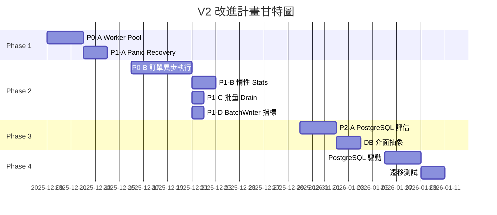

# DES Trading System V2.0 - 性能改進計畫 V2

> **版本**: 2.0  
> **創建日期**: 2025-12-08  
> **預計執行週期**: 4-6 週  
> **前置條件**: V1 改進計畫已完成  
> **基於文檔**: [性能分析報告 V2](../architecture/PERFORMANCE_ANALYSIS.md)

---

## 📋 目錄

1. [計畫概述](#計畫概述)
2. [V1 改進回顧](#v1-改進回顧)
3. [V2 改進優先級矩陣](#v2-改進優先級矩陣)
4. [Phase 1: 關鍵穩定性強化](#phase-1-關鍵穩定性強化)
5. [Phase 2: 性能深度優化](#phase-2-性能深度優化)
6. [Phase 3: 架構升級準備](#phase-3-架構升級準備)
7. [Phase 4: 資料庫遷移](#phase-4-資料庫遷移)
8. [實施時間表](#實施時間表)
9. [風險評估與緩解](#風險評估與緩解)
10. [驗收標準](#驗收標準)

---

## 計畫概述

### 1.1 背景

V1 改進計畫已成功完成，系統能力大幅提升：

| 改進項目 | 效果 |
|----------|------|
| 策略並行化 | 擴展性 5-10x |
| WebSocket 重連 | 穩定性 +++ |
| 訂單佇列溢出緩衝 | 容錯性 +++ |
| 分片快取 | 並發 16x |
| 批次寫入器 | 吞吐 3-5x (可選) |
| 性能監控 | 可觀測性 +++ |

### 1.2 V2 目標

基於 V2 性能分析報告識別的新瓶頸，本計畫旨在：

1. **消除 Goroutine 風險** - Worker Pool 限制並發
2. **提升訂單執行效率** - 異步執行 + 並行處理
3. **優化監控系統** - 惰性計算減少開銷
4. **突破 SQLite 限制** - PostgreSQL 遷移

### 1.3 範圍

| 在範圍內 | 不在範圍內 |
|----------|-----------|
| 策略執行優化 | 新策略類型開發 |
| 訂單處理改進 | 新交易所支援 |
| 資料庫遷移 | 微服務拆分 |
| 監控系統優化 | UI/UX 改進 |

### 1.4 成功指標

| 指標 | V1 後基準 | V2 目標 | 提升幅度 |
|------|-----------|---------|----------|
| 策略處理延遲 (20 策略) | ~5ms | <2ms | 60%+ |
| 訂單端到端延遲 P99 | ~100ms | <50ms | 50%+ |
| 最大策略數量 | ~50 | **無限** (worker pool) | ∞ |
| 訂單 TPS | ~20 | >100 | 5x |
| /api/metrics 延遲 | ~10ms | <1ms | 10x |

---

## V1 改進回顧

### 2.1 已完成項目

| ID | 項目 | 狀態 | 檔案 |
|----|------|------|------|
| P0-A | WebSocket 自動重連 | ✅ | `pkg/market/binance/websocket.go` |
| P0-B | 策略引擎並行化 | ✅ | `internal/strategy/engine.go` |
| P1-A | 訂單佇列溢出緩衝 | ✅ | `internal/order/queue.go` |
| P1-B | 性能監控系統 | ✅ | `internal/monitor/metrics.go` |
| P1-C | 批次寫入器 | ✅ | `internal/persistence/batch_writer.go` |
| P2-A | 分片快取 | ✅ | `pkg/cache/sharded_cache.go` |
| P2-B | 快取清理機制 | ✅ | `pkg/cache/sharded_cache.go` |

### 2.2 V2 新識別問題

| 問題 | 來源 | 嚴重度 |
|------|------|--------|
| 策略無 Worker Pool 限制 | V2 分析 | 🔴 高 |
| 訂單同步執行阻塞 | V2 分析 | 🔴 高 |
| Drain 鎖頻繁 | V2 分析 | 🟡 中 |
| Stats() O(n log n) 開銷 | V2 分析 | 🟡 中 |
| BatchWriter 指標未追蹤 | V2 分析 | 🟢 低 |
| 策略無 Panic Recovery | V2 分析 | 🟡 中 |
| SQLite 仍單連線 | V1 遺留 | 🔴 高 |

---

## V2 改進優先級矩陣

```
                    高影響
                      │
         P0-A         │         P0-B
    Worker Pool       │    訂單異步執行
                      │
    ──────────────────┼──────────────────
                      │
         P1-A         │         P1-B
    Panic Recovery    │    惰性 Stats
                      │
                    低影響
         低緊急 ◀─────┼─────▶ 高緊急
```

### 詳細優先級

| ID | 改進項目 | 優先級 | 影響 | 工作量 | 風險 |
|----|----------|--------|------|--------|------|
| P0-A | 策略 Worker Pool | 🔴 P0 | 高 | 低 | 低 |
| P0-B | 訂單異步執行 | 🔴 P0 | 高 | 中 | 中 |
| P1-A | Panic Recovery | 🟡 P1 | 中 | 低 | 低 |
| P1-B | 惰性 Stats 計算 | 🟡 P1 | 中 | 低 | 低 |
| P1-C | 批量 Drain Overflow | 🟡 P1 | 中 | 低 | 低 |
| P1-D | BatchWriter 指標追蹤 | 🟡 P1 | 低 | 低 | 低 |
| P2-A | PostgreSQL 遷移評估 | 🟢 P2 | 規劃 | 中 | 無 |
| P2-B | Redis 快取層 | 🟢 P2 | 規劃 | 高 | 中 |

---

## Phase 1: 關鍵穩定性強化

**時間**: 第 1-2 週  
**目標**: 消除 Goroutine 爆發風險，確保系統穩定

### 1.1 P0-A: 策略 Worker Pool

#### 問題描述
當前策略並行化為每個 tick 創建 N 個 goroutine (N=策略數)，高頻場景可能導致 goroutine 洩漏。

#### 實施方案

**檔案**: `internal/strategy/engine.go`

```go
// 修改 Engine 結構體
type Engine struct {
    strategies  []Strategy
    paused      map[string]bool
    bus         *events.Bus
    ctx         Context
    db          *sql.DB
    dataService *data.HistoricalDataService
    
    // 新增
    workerPool  chan struct{}
    poolSize    int
}

// 修改 NewEngine
func NewEngine(bus *events.Bus, db *sql.DB, ctx Context) *Engine {
    poolSize := runtime.NumCPU() * 2
    if poolSize < 4 {
        poolSize = 4
    }
    
    return &Engine{
        strategies:  make([]Strategy, 0),
        paused:      make(map[string]bool),
        bus:         bus,
        ctx:         ctx,
        db:          db,
        workerPool:  make(chan struct{}, poolSize),
        poolSize:    poolSize,
    }
}

// 修改 handleTick
func (e *Engine) handleTick(msg any) {
    // ... 解析 symbol, price ...
    
    activeStrategies := e.getActiveStrategies()
    if len(activeStrategies) == 0 {
        return
    }
    
    var wg sync.WaitGroup
    signals := make(chan *Signal, len(activeStrategies))
    
    for _, s := range activeStrategies {
        wg.Add(1)
        
        // 獲取 worker slot (限制並發)
        e.workerPool <- struct{}{}
        
        go func(strat Strategy) {
            defer wg.Done()
            defer func() { <-e.workerPool }()  // 釋放 worker slot
            defer e.recoverFromPanic(strat.ID())
            
            sig, err := strat.OnTick(symbol, price, indVals)
            if err != nil {
                log.Printf("strategy %s error: %v", strat.Name(), err)
                return
            }
            if sig != nil {
                sig.StrategyID = strat.ID()
                signals <- sig
            }
        }(s)
    }
    
    go func() {
        wg.Wait()
        close(signals)
    }()
    
    for sig := range signals {
        e.bus.Publish(events.EventStrategySignal, *sig)
    }
}
```

#### 修改檔案清單
| 檔案 | 變更類型 | 說明 |
|------|----------|------|
| `internal/strategy/engine.go` | 修改 | 新增 workerPool, poolSize 欄位 |

#### 測試計畫
- [ ] 單元測試：限制並發數驗證
- [ ] 壓力測試：100+ 策略 + 高頻 tick
- [ ] 監控測試：`/api/metrics` Goroutine 數量穩定

#### 驗收標準
- [ ] Goroutine 數量不超過 poolSize × 2
- [ ] 高頻場景下無 goroutine 洩漏
- [ ] 效能無明顯下降

---

### 1.2 P1-A: Panic Recovery

#### 問題描述
策略 OnTick panic 可能影響其他策略執行。

#### 實施方案

**檔案**: `internal/strategy/engine.go`

```go
// 新增方法
func (e *Engine) recoverFromPanic(strategyID string) {
    if r := recover(); r != nil {
        stack := debug.Stack()
        log.Printf("❌ Strategy %s panicked: %v\n%s", strategyID, r, stack)
        
        // 自動暫停出錯策略
        e.paused[strategyID] = true
        
        // 發布錯誤事件
        e.bus.Publish(events.EventStrategyError, StrategyError{
            StrategyID: strategyID,
            Error:      fmt.Sprintf("%v", r),
            Stack:      string(stack),
            Timestamp:  time.Now(),
        })
    }
}
```

#### 驗收標準
- [ ] 單一策略 panic 不影響其他策略
- [ ] Panic 策略自動暫停
- [ ] 錯誤事件正確發布

---

## Phase 2: 性能深度優化

**時間**: 第 3-4 週  
**目標**: 提升關鍵路徑性能

### 2.1 P0-B: 訂單異步執行

#### 問題描述
當前 `Executor.Handle()` 同步等待交易所回應，阻塞訂單佇列處理。

#### 實施方案

**新檔案**: `internal/order/async_executor.go`

```go
package order

import (
    "context"
    "log"
    "sync"
)

// AsyncExecutor wraps Executor for non-blocking execution.
type AsyncExecutor struct {
    executor   *Executor
    resultCh   chan ExecutionResult
    workerPool chan struct{}
    wg         sync.WaitGroup
}

type ExecutionResult struct {
    OrderID string
    Success bool
    Error   error
    Latency time.Duration
}

func NewAsyncExecutor(executor *Executor, workers int) *AsyncExecutor {
    if workers <= 0 {
        workers = 4
    }
    return &AsyncExecutor{
        executor:   executor,
        resultCh:   make(chan ExecutionResult, 100),
        workerPool: make(chan struct{}, workers),
    }
}

// ExecuteAsync submits order for async execution.
func (a *AsyncExecutor) ExecuteAsync(ctx context.Context, order Order) {
    a.wg.Add(1)
    a.workerPool <- struct{}{}
    
    go func() {
        defer a.wg.Done()
        defer func() { <-a.workerPool }()
        
        start := time.Now()
        err := a.executor.Handle(ctx, order)
        
        result := ExecutionResult{
            OrderID: order.ID,
            Success: err == nil,
            Error:   err,
            Latency: time.Since(start),
        }
        
        select {
        case a.resultCh <- result:
        default:
            log.Printf("⚠️ Result channel full, dropping result for %s", order.ID)
        }
    }()
}

// Results returns the result channel for monitoring.
func (a *AsyncExecutor) Results() <-chan ExecutionResult {
    return a.resultCh
}

// WaitAll waits for all pending executions.
func (a *AsyncExecutor) WaitAll() {
    a.wg.Wait()
}
```

#### 整合方式

**修改**: `main.go`

```go
// 舊代碼
exec := order.NewExecutor(database, bus, gateway, venue, cfg.BinanceTestnet)

// 新代碼
exec := order.NewExecutor(database, bus, gateway, venue, cfg.BinanceTestnet)
asyncExec := order.NewAsyncExecutor(exec, 4)

// 結果監控 goroutine
go func() {
    for result := range asyncExec.Results() {
        if !result.Success {
            log.Printf("❌ Order %s failed: %v", result.OrderID, result.Error)
        }
        sysMetrics.OrderLatency.RecordDuration(result.Latency)
    }
}()

// 修改 Drain
go orderQueue.Drain(ctx, func(o order.Order) {
    asyncExec.ExecuteAsync(ctx, o)
})
```

#### 驗收標準
- [ ] 訂單非阻塞提交
- [ ] 支援最大並發數配置
- [ ] 執行結果可監控
- [ ] 延遲指標自動記錄

---

### 2.2 P1-B: 惰性 Stats 計算

#### 問題描述
當前 `LatencyHistogram.Stats()` 每次調用 O(n log n) 排序。

#### 實施方案

**檔案**: `internal/monitor/metrics.go`

```go
type LatencyHistogram struct {
    mu         sync.Mutex
    samples    []float64
    maxSize    int
    
    // 惰性計算
    sorted     []float64
    dirty      bool
    cachedStats LatencyStats
}

func (h *LatencyHistogram) Record(latencyMs float64) {
    h.mu.Lock()
    defer h.mu.Unlock()
    
    if len(h.samples) >= h.maxSize {
        h.samples = h.samples[1:]
    }
    h.samples = append(h.samples, latencyMs)
    h.dirty = true  // 標記需重新計算
}

func (h *LatencyHistogram) Stats() LatencyStats {
    h.mu.Lock()
    defer h.mu.Unlock()
    
    if !h.dirty && h.cachedStats.Count > 0 {
        return h.cachedStats  // 返回快取
    }
    
    n := len(h.samples)
    if n == 0 {
        return LatencyStats{}
    }
    
    // 僅在 dirty 時重新計算
    h.sorted = make([]float64, n)
    copy(h.sorted, h.samples)
    sort.Float64s(h.sorted)
    
    var sum float64
    min, max := h.sorted[0], h.sorted[n-1]
    for _, v := range h.sorted {
        sum += v
    }
    
    h.cachedStats = LatencyStats{
        Min:   min,
        Max:   max,
        Avg:   sum / float64(n),
        P50:   h.sorted[n/2],
        P95:   h.sorted[int(float64(n)*0.95)],
        P99:   h.sorted[int(float64(n)*0.99)],
        Count: n,
    }
    h.dirty = false
    
    return h.cachedStats
}
```

#### 驗收標準
- [ ] 連續調用 Stats() 無重複排序
- [ ] Record() 後下次 Stats() 正確更新
- [ ] API 響應延遲 < 1ms

---

### 2.3 P1-C: 批量 Drain Overflow

#### 問題描述
當前 Drain 每次處理 overflow 都獲取鎖。

#### 實施方案

**檔案**: `internal/order/queue.go`

```go
// 新增批量取出方法
func (q *Queue) drainOverflowBatch() []Order {
    q.mu.Lock()
    if len(q.overflowBuf) == 0 {
        q.mu.Unlock()
        return nil
    }
    
    batch := q.overflowBuf
    q.overflowBuf = make([]Order, 0, cap(batch))
    q.mu.Unlock()
    
    return batch
}

// 修改 Drain
func (q *Queue) Drain(ctx context.Context, handler func(Order)) {
    for {
        // 批量處理 overflow
        if batch := q.drainOverflowBatch(); batch != nil {
            for _, o := range batch {
                atomic.AddUint64(&q.metrics.Dequeued, 1)
                handler(o)
            }
            continue
        }
        
        // 處理主 channel
        select {
        case <-ctx.Done():
            return
        case o, ok := <-q.ch:
            if !ok {
                return
            }
            atomic.AddUint64(&q.metrics.Dequeued, 1)
            handler(o)
        }
    }
}
```

#### 驗收標準
- [ ] 批量處理減少鎖獲取次數
- [ ] 無訂單丟失
- [ ] 性能提升可測量

---

### 2.4 P1-D: BatchWriter 指標追蹤

#### 問題描述
`BatchWriterMetrics` 已定義但未實際使用。

#### 實施方案

**檔案**: `internal/persistence/batch_writer.go`

```go
type BatchWriter struct {
    // ... 現有欄位 ...
    
    metrics BatchWriterMetrics
}

type BatchWriterMetrics struct {
    TotalWrites   uint64
    TotalBatches  uint64
    TotalErrors   uint64
    LastBatchSize int
    LastFlushTime time.Time
}

func (bw *BatchWriter) executeBatch(ops []WriteOp) error {
    if len(ops) == 0 {
        return nil
    }
    
    atomic.AddUint64(&bw.metrics.TotalWrites, uint64(len(ops)))
    atomic.AddUint64(&bw.metrics.TotalBatches, 1)
    bw.metrics.LastBatchSize = len(ops)
    bw.metrics.LastFlushTime = time.Now()
    
    tx, err := bw.db.Begin()
    if err != nil {
        atomic.AddUint64(&bw.metrics.TotalErrors, 1)
        return err
    }
    // ... 其餘不變 ...
}

// 新增方法
func (bw *BatchWriter) GetMetrics() BatchWriterMetrics {
    return BatchWriterMetrics{
        TotalWrites:   atomic.LoadUint64(&bw.metrics.TotalWrites),
        TotalBatches:  atomic.LoadUint64(&bw.metrics.TotalBatches),
        TotalErrors:   atomic.LoadUint64(&bw.metrics.TotalErrors),
        LastBatchSize: bw.metrics.LastBatchSize,
        LastFlushTime: bw.metrics.LastFlushTime,
    }
}
```

---

## Phase 3: 架構升級準備

**時間**: 第 5 週  
**目標**: 評估和準備資料庫遷移

### 3.1 P2-A: PostgreSQL 遷移評估

#### 評估項目

| 項目 | 說明 | 負責 |
|------|------|------|
| Schema 兼容性 | SQLite → PostgreSQL 語法差異 | 自動 |
| 連線池配置 | 最大連線數、超時設定 | 配置 |
| 遷移腳本 | 數據遷移 SQL | 手動 |
| 回滾計劃 | 遷移失敗復原 | 手動 |

#### 準備工作

1. **抽象資料庫介面**

**新檔案**: `pkg/db/interface.go`

```go
package db

import (
    "context"
    "database/sql"
)

// Repository defines database operations interface.
type Repository interface {
    // Orders
    CreateOrder(ctx context.Context, order Order) error
    GetOrder(ctx context.Context, id string) (*Order, error)
    ListOrders(ctx context.Context, limit int) ([]Order, error)
    
    // Trades
    CreateTrade(ctx context.Context, trade Trade) error
    
    // Positions
    GetPosition(ctx context.Context, symbol string) (*Position, error)
    UpsertPosition(ctx context.Context, pos Position) error
    
    // Transactions
    Begin() (*sql.Tx, error)
}
```

2. **PostgreSQL 驅動準備**

```go
// pkg/db/postgres.go
package db

import (
    "database/sql"
    _ "github.com/lib/pq"
)

type PostgresDatabase struct {
    DB *sql.DB
}

func NewPostgres(connStr string) (*PostgresDatabase, error) {
    db, err := sql.Open("postgres", connStr)
    if err != nil {
        return nil, err
    }
    
    db.SetMaxOpenConns(25)
    db.SetMaxIdleConns(5)
    db.SetConnMaxLifetime(5 * time.Minute)
    
    return &PostgresDatabase{DB: db}, nil
}
```

---

## Phase 4: 資料庫遷移

**時間**: 第 6 週  
**目標**: 可選執行 PostgreSQL 遷移

### 4.1 遷移策略

```
階段 A: 雙寫模式 (可選)
┌──────────────┐    ┌──────────────┐
│   SQLite    │───▶│  PostgreSQL  │
│   (主庫)    │    │   (備庫)     │
└──────────────┘    └──────────────┘

階段 B: 切換主庫
┌──────────────┐    ┌──────────────┐
│   SQLite    │    │  PostgreSQL  │
│   (備庫)    │◀───│   (主庫)     │
└──────────────┘    └──────────────┘

階段 C: 移除 SQLite
                    ┌──────────────┐
                    │  PostgreSQL  │
                    │   (唯一)     │
                    └──────────────┘
```

### 4.2 配置變更

**修改**: `pkg/config/config.go`

```go
type Config struct {
    // ... 現有欄位 ...
    
    // 資料庫配置
    DBType        string `env:"DB_TYPE" envDefault:"sqlite"`       // sqlite | postgres
    PostgresURL   string `env:"POSTGRES_URL"`                       // PostgreSQL 連線字串
    PostgresPool  int    `env:"POSTGRES_POOL" envDefault:"25"`     // 連線池大小
}
```

---

## 實施時間表



### 詳細任務清單

| 週次 | 任務 | 狀態 |
|------|------|------|
| Week 1 | P0-A: 策略 Worker Pool | 🔲 |
| Week 1 | P1-A: Panic Recovery | 🔲 |
| Week 2 | P0-B: 訂單異步執行 | 🔲 |
| Week 2 | P1-B: 惰性 Stats 計算 | 🔲 |
| Week 3 | P1-C: 批量 Drain Overflow | 🔲 |
| Week 3 | P1-D: BatchWriter 指標追蹤 | 🔲 |
| Week 4 | P2-A: PostgreSQL 遷移評估 | 🔲 |
| Week 4 | 資料庫介面抽象 | 🔲 |
| Week 5 | PostgreSQL 驅動實作 | 🔲 |
| Week 5 | 遷移測試 | 🔲 |
| Week 6 | 生產遷移 (可選) | 🔲 |

---

## 風險評估與緩解

| 風險 | 可能性 | 影響 | 緩解措施 |
|------|--------|------|----------|
| Worker Pool 過小導致延遲 | 中 | 中 | 可配置 pool size |
| 異步執行結果丟失 | 低 | 高 | 結果 channel buffer + 監控 |
| PostgreSQL 遷移數據不一致 | 低 | 高 | 雙寫驗證 + 回滾計劃 |
| 惰性計算快取失效 | 低 | 低 | 完整單元測試 |

---

## 驗收標準

### Phase 1 驗收

- [ ] `go test -race` 無競態條件
- [ ] Goroutine 數量穩定 (< poolSize × 3)
- [ ] 策略 panic 不影響系統

### Phase 2 驗收

- [ ] 訂單執行異步化
- [ ] `/api/metrics` 延遲 < 1ms
- [ ] BatchWriter 指標可查詢

### Phase 3-4 驗收 (可選)

- [ ] PostgreSQL 驅動可用
- [ ] 雙寫測試通過
- [ ] 遷移回滾可行

---

## 附錄

### A. 相關文件

- [性能分析報告 V2](../architecture/PERFORMANCE_ANALYSIS.md)
- [性能改進計畫 V1](./PERFORMANCE_IMPROVEMENT_PLAN_V1.md)
- [系統架構](../architecture/SYSTEM_ARCHITECTURE.md)

### B. 版本歷史

| 版本 | 日期 | 變更 |
|------|------|------|
| 2.0 | 2025-12-08 | 根據 V2 分析建立改進計畫 |

---

*本計畫基於 V2 性能分析報告，預計 4-6 週完成。Phase 3-4 (資料庫遷移) 為可選執行。*
